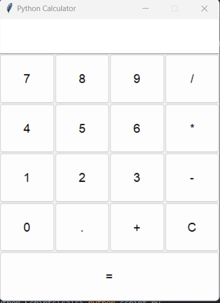

# PyCalc
 **PyCalc** is a simple calculator with a GUI built in Python. It utilizes Tkinter for the interface. The main purpose of this project was to get more of a handle on Python to expand my knowledge in the language.

 ## Usage
 Simply download the repo, navigate to the directory, run a terminal and type `python script.py`.

 ## Screenshot
 